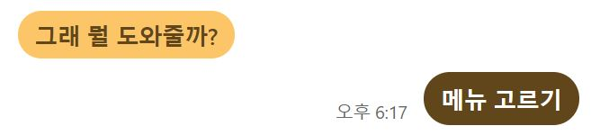
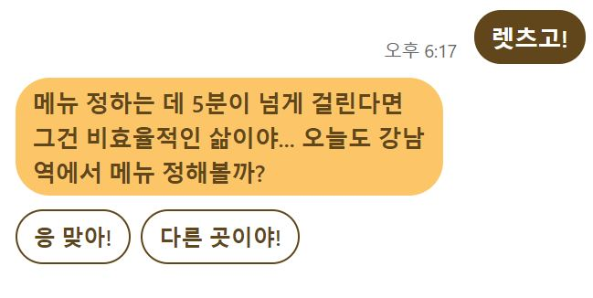
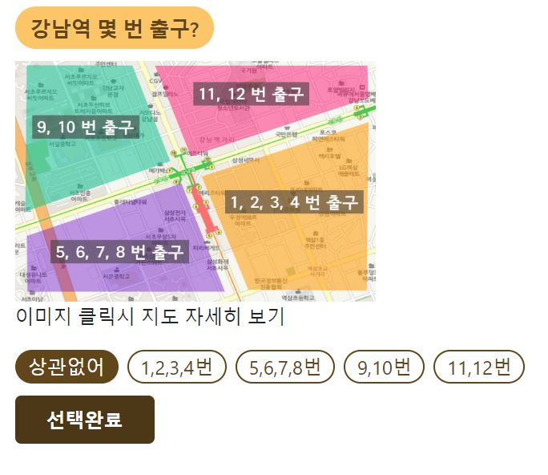
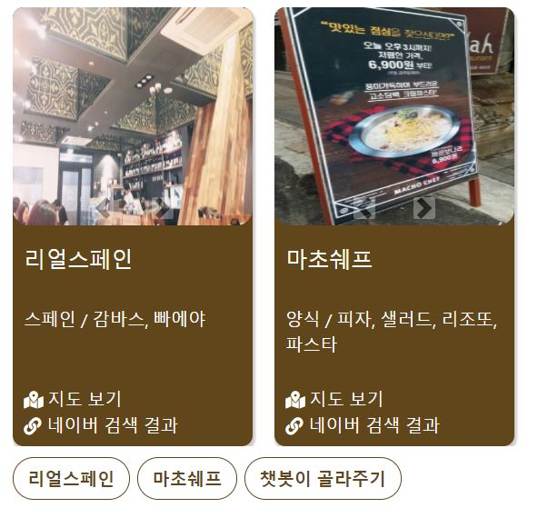
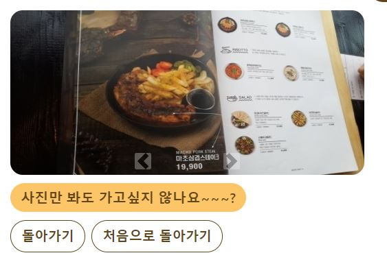
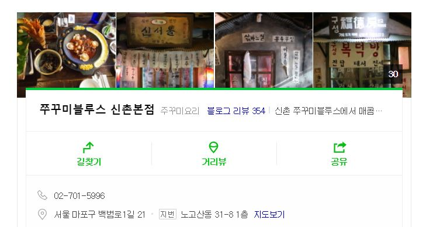

# foodle-web-chatbot

 socket.io 라이브러리를 이용해서 만든 웹 기반 챗봇이다.

> Socket.io Docs
>
> https://socket.io

## 0.개발 환경

- Node.js : v10.14
- - 최대한 ES6이나 ES8 문법을 적용하도록 노력하였으며, 비동기 처리는 async await문법을 이용하였다.
- AWS EC2 - Ubuntu 16.04
- AWS RDS - MySQL (5.7)

**eslint**
```javascript
  // .eslintrc
  // airbnb 설정에서, 일부 조건을 추가하였다

  {
    "extends": "eslint-config-airbnb",
    "env": {
    "jquery": true
    },
    "rules":{
      "linebreak-style": 0,
      "class-methods-use-this": 0,
      "quote-props": 0,
      "func-names": 0,
      "no-console": 0,
      "camelcase": 0,
      "no-shadow": 0,
      "radix": 0,
      "max-len": 0,
      "no-unused-expressions": [2, { allowShortCircuit: true, allowTernary: true }]
    }
  }
```

## 1. 설치

각 OS에 맞게 Node.js를 설치하고 이 프로잭트의 소스코드를 클론하고 directory안에서 아래의 명령어를 통해 실행한다.

```javascript
npm init
npm start
```
> 현재 코드에선, 기본 포트로 9001을 사용하고 있다.

----


## 2. 구조 개요


사용자가 챗봇 웹에 접속해서, 채팅을 치거나 버튼을 입력하게되면서, 서버상에서 사용자의 input을 가지고 사용자에게 메세지를 보내는 것 까지의 과정을 화살표로 표현하였다. (파란색 화살표는 대략적인 output의 흐름을 나타낸다.)

1. 사용자가 메세지를 보내는 방법은 3가지가 있다.
   - 각 시나리오를 진행시키는 버튼을 누르는 경우
   - 텍스트 인풋 폼에 메세지를 입력한 후, Enter 키를 누르는 경우
   - 텍스트 인풋 폼에 메세지를 입력한 후, 보내기 버튼을 누르는 경우
2. 위 3가지 경우를 event.js에서 판단한 후,  각 경우에 맞는 이벤트를 bin/www로 발생시킨다.
3. bin/www에서는, 해당 이벤트에 맞는 처리를 하기 위해, scenario_rule.js로  socket 정보와 사용자의 input정보를 보낸다.
4. scenario_rule.js에서는, 사용자의 DB를 불러오고, scenario 값에 따라 flow/scenario내의 해당 시나리오로 정보를 보낸다.
5. scenario/flow 내의 시나리오에서는, 넘어온 정보를 가지고 message_type과, message를 판단해서, 다시 최종적으로 사용자에게 메세지를 전달하는 sendSocketMessage 함수를 실행한다.
6. sendSocektMessage함수에서는, 최종적으로 메세지를 보내는 정보를 가지고, event.js로 이벤트를 발생시킨다.
7. 마지막으로, event.js에서, 넘어온 이벤트를 바탕으로, 사용자의 채팅창에 메세지를 업데이트 시킨다.

-----


## 3. 모듈

**[api/api_prototype](./api/api_prototype.js)**

- 모든 api 호출에서 사용될 특징을 모아둔 module이다. api 호출 함수를 작성하다 보니 가독성이 떨어지고 error 처리와 log를 남기는 부분이 반복되는 것 같아서 이러한 함수를 만들어 관리하는 방식을 취하였다.

**[api/info_update](./api/info_update)**

- scenario와 state에 따라 해당 strategy에 맞게 호출하는 api들이 모여져 있는 module이다. DB의 각 테이블과 연관된 api끼리 같이 묶어놓았다.

[**server/index**](./server/index)

- 서버의 기본 설정을 담고 있음. socket.io의 서버측 이벤트 코드와, 사용자에게 최종적으로 메세지를 전달하는 역할을 하는 sendSocketMessage 함수를 포함하고 있음.

**[flow/scenario_rule](./flow/scenario_rule.js)**

- bin/www에서 넘겨받은 소켓정보와 val값(버튼일시 button_id, 텍스트일시 텍스트의 string)을 가지고, 어떤 시나리오에서 시나리오가 진행되는지 판단하고, 해당 시나리오로 이동시킨다.

**[flow/scenario](./flow/scenario)**

- 이 폴더 안에는 여러 시나리오들의 코드가 담겨있다. 각 시나리오마다 어떤 메세지타입과 메세지를 사용자에에게 보내야 하는지를 처리해준다.

## 4. 주요 시나리오

#### Decide_menu

사용자의 선택에 따라 음식점을 최종적으로 선택해 주는 시나리오이다.

전체적인 flow는 다음과 같다.

1. 지하철 선택
2. 출구 선택
3. mood(캐주얼/약속) 선택
4. mood2(mood가 약속일때만 진행, 캐주얼은 패스) 선택
5. taste 선택
6. food_type 선택
7. 2개 후보 추천 및 선택
8. 최종 음식점 정보 제공

각 시나리오의 사용자의 선택 마다, 사용자 DB의 해당 칼럼을 업데이트 시키면서, 최종적으로 사용자의 정보를 가지고 음식점을 추천해준다.

>사용자가 이 시나리오를 진행하는 시간이 점심일 경우, 점심 메뉴 여부도 알려준다.
>
>30분당 5번만 이 시나리오를 진행할 수 있다.(8-6 참고)

지하철 선택 시, 자동완성 기능을 이용하여, 현재 DB에 등록된 지하철만 선택할 수 있도록 하였다.

#### Decide_drink

사용자의 선택에 따라 술집을 최종적으로 선택해 주는 시나리오이며, decide_menu와 같은 흐름이다.

**[시나리오](./readme_img/decide_drink_scenario.xlsx)** 참고

각 시나리오의 사용자의 선택 마다, 사용자 DB의 해당 칼럼을 업데이트 시키면서, 최종적으로 사용자의 정보를 가지고 술집을 추천해준다.

> 30분당 5번만 이 시나리오를 진행할 수 있다.(8-6 참고)

지하철 선택 시, 자동완성 기능을 이용하여, 현재 DB에 등록된 지하철만 선택할 수 있도록 하였다.

#### Decide_place

사용자와 그 외 사람들의 위치를 입력해서, 중간 지점의 핫 플레이스를 추천해주는 기능이다.

1. 장소를 입력할 때마다, 카카오 맵 API를 이용해서 해당 장소의 위도, 경도를 받는다.
2. 사용자의 칼럼에, 장소 개수와, 위도 경도의 합을 계속 더해준 후, 가장 중간의 위도 경도를 계산한다.
3. 코드 상에 설정해놓은 장소들과 위도 경도를, 하버사인(Haversine) 공식을 이용하여 해당 중간 위도 경도와 비교한다.
4. 가장 거리가 가까운 3곳을 추천해준다.

#### Decide_history

사용자가 선택한 음식점에 대한 기록을 나타내주는 기능이다.

- 선택 횟수 별 기록
- 지하철 별 기록
- 최근 날짜 순 기록

위 3가지의 기록을 제공한다.

#### User_feedback

사용자가 관리자에게 피드백을 할 수 있는 기능이다.

간단한 text input을 통해, 피드백이 가능하다.

#### Chitchat

자연어 처리 기능을 가진 챗봇과 대화를 할 수 있는 기능이다. 대화를 할 때마다, API를 호출해서, 의도를 파악 후 답변을 출력한다.

>**[jellynlp-sion/README](https://bitbucket.org/jellylab/jelly-nlp-sion/src/master/README.md)**

----


## 5. 메세지 형식

모든 메세지 형식은, [event.js](./public/javscript/event.js) 안에 이벤트로 정의되어 있다. 최종적으로, sendSocketMessage에서, 인자로 message_type과 메세지들을 보내주게 되는데, 이 때 오는 message_type을 바탕으로, 메세지 형식을 결정한다.

#### chat message self



모든 시나리오에서 사용되는 이벤트이다. 대부분의 메신저는, 사용자가 메세지를 보내게 되면, 상대방이 답만 해줄 뿐 아니라, 해당 사용자가 보낸 메세지를 오른쪽에 표시해준다. 자기 자신의 메세지를 보내주는 이벤트를 chat message self로 정의하였다.

> 모든 곳에서 사용되므로, 앞 단계의 bin/www 에서 바로 이벤트를 발생시키게 하였음

#### chat message button



가장 많이사용되는 메세지 형식이다. 기본적으로, 메세지+버튼의 구조를 갖추고 있다.  버튼에 대한 정보를 spread parameter로 받기 때문에, 버튼을 동적으로 생성할 수 있다. 만약 버튼의 정보를 담은 spread parameter에 아무것도 전달하지 않으면, 버튼이 없고 텍스트 인풋이 가능한 형식으로 자동으로 메세지를 보낸다.

#### chat message checkbox



사용자의 여러 선택을 반영하기 위해 만든 형식이다.

**출구 선택**과,식당 분위기를 **약속** 으로 선택했을 때 나오는 메세지 형식인데,

이 형식은 버튼을 눌러도 다음시나리오가 진행되지 않고, 체크만 된다.

해당 버튼을 체크하고, 선택완료 버튼을 누르게 되면, 체크된 값을 판단해서 시나리오에 반영시킨다.

| 버튼              | 클릭 시                                            |
| ----------------- | -------------------------------------------------- |
| 상관없음(default) | 그 외 버튼의 체크가 해제되고, 상관없음이 선택된다. |
| 그 외 버튼        | 상관없음 버튼이 해제되고, 그 외 버튼이 선택된다.   |
| 선택완료          | 선택된 버튼이 있을 시, 다음시나리오로 넘어간다.    |


**만약, 체크된 값이 아무것도 없을 경우에는, 다음 시나리오로 진행되지 않게하는 예외처리를 하였다.**

#### chat message dynamic checkbox


**chat message checkbox**와 보여지는 부분은 동일하지만, 서버사이드에서 위 형식을 만들어내는 로직이 다르다.

두 형식 모두 event.js에서 rest parameter로 버튼을 받기 때문에, 동적으로 버튼을 만들 수 있지만, **chat message checkbox**의 경우 API나, 외부 로직에 의해 버튼이 결과값으로 나온 경우, 해당 결과에 따른 버튼 체크박스를 만들 수 없다.

술집 고르기 시나리오에서, 선택한 subway, exit_quarter에서 존재하지 않는 drink_type은 버튼에서 제외해야 하기 때문에, 해당 조건을 만족하는 종류를 결과로 받는 API를 호출한 후 , 결과에 따른 버튼을 생성해야하기 때문에, 위 경우에 해당된다.


버튼들을 배열에 담아서 인자로 보내주게되면, event.js의 이벤트 상에서, 해당 버튼들 만큼 체크박스 버튼을 생성한다.

```javascript
//event.js

// 첫번째 버튼, 상관없음 버튼에 해당
$('#messages').append(bot_messaging_button_checkbox(args[0][0], args[0][1]));
const args_length = args[1].length;
for (let i = 0; i < args_length; i += 1) {
    // 나머지 버튼
    $('#messages').append(bot_messaging_button_checkbox(args[1][i], args[1][i]));
}
// 마지막 버튼, 선택완료 버튼에 해당
$('#messages').append(bot_messaging_button_finish_checkbox(args[2][0], args[2][1]));
```


#### chat message card



모든 사전 시나리오를 진행한 후,  최종 음식점 후보 두 곳에 대한 정보를 보여주고, 유저가 하나의 음식점을 선택할 수 있도록 도와주는 형식이다. 기본적으로, **bootstrap**의 **card** 형식을 이용하였고, 내부 이미지 슬라이드는, 마찬가지로 **bootstrap**의 **carousel** 형식을 이용하였다.   

스마트폰으로 접속한 경우, 내부 사진 슬라이드는 touch swipe를 통해 넘길수 없고, 오로지 화살표 클릭을 통해 넘길 수 있지만, 외부 카드 정보의 경우에는, touch swipe를 통해 넘길 수 있다.

#### chat message image


최종 음식점을 선택하고, **사진 보기** 를 눌렀을 때, 나오는 사진 슬라이드 이다. 앞선 **chat message card** 와 동일하게, **carousel** 형식을 이용하였다.

-----


## 6. 새로운 시나리오 만들기

#### 6.0 views/index.ejs 수정(메인에서 바로 진입가능한 시나리오에만 해당)

초기 화면에서 바로 진입할 수 있는 시나리오를 만드는 경우, index.ejs 코드에서 진입할 수 있는 버튼을 새로 하나 만들어 주어야한다.

```html
<div class="message-button">
  <button type="button" class="messaging-button" id="decide_menu" name="메뉴 고르기">메뉴 고르기</button>
  <button type="button" class="messaging-button" id="decide_place" name="중간지점 찾기(서울)">중간지점 찾기(서울)</button>
  <button type="button" class="messaging-button" id="decide_history" name="기록 보기">기록 보기</button>
  <button type="button" class="messaging-button" id="user_feedback" name="개발팀에게 피드백하기">개발팀에게 피드백하기</button>
  <button type="button" class="messaging-button" id="chitchat" name="외식코기랑 대화하기">외식코기랑 대화하기</button>
</div>

위 코드에서, 똑같은 형식을 가진 버튼을 하나 만들어 주면 된다.
단, button의 id attribute에는 해당 시나리오의 이름을 적어야 한다.
```

#### 6.1 flow/scenario/Toolbox.js 수정(메인에서 바로 진입가능한 시나리오에만 해당)

user의 초기 scenario값은 100이다(Toolbox의 시나리오 값). 그러므로, Toolbox 클래스에 새로운 시나리오 버튼에 대한 strategy를 추가 한다.

```javascript
this.strategies = {
      'get_started': this.get_started,
      'decide_menu': this.decide_menu,
      'decide_place': this.decide_place,
      'decide_history': this.decide_history,
      'user_feedback': this.user_feedback,
      'chitchat': this.chitchat,
    };

에서, strategies 객체 안에, 새로운 시나리오로 이동할 strategy를 만들어주고, 클래스 메소드에 그 시나리오를 작성한다.

new_scenario_example(value, socket, user_data) {
  }
```

#### 6.2 flow/scenario 수정

이제, flow/scenario 폴더 안에, 새로운 시나리오에 대한 클래스를 만들어 준다. 그 후에는, 다른 시나리오 코드와 같이, 기본적인 틀을 작성하고, 하나의 시나리오에 대해 하나의 클래스 메소드를 정의하여 시나리오를 작성하면 된다.

```javascript
const Info = require('../../api/info_update');

const index = require('../../bin/www');

const info_update = new Info();


class New_scenario {
  constructor(value, socket, user_data) {
    let key;
    key = value;

    this.strategies = {
      'new_strategy': this.new_strategy,
    };
    this.execute(key, value, socket, user_data);
  }

  execute(key, value, socket, user_data) {
    this.update_state(socket.id, '새로운 시나리오의 scenario 번호', key);
    this.strategies[key] == null ? console.log('this strategy does not exist') : this.strategies[key](value, socket, user_data);
  }

  update_state(id, scenario, state) {
    (async function (id, scenario, state) {
      try {
        await info_update.profile.update_state(id, scenario, state);
      } catch (e) {
        console.log(e);
      }
    }(id, scenario, state));
  }

  new_strategy(value, socket, user_data) {
    (async function () {
      try {
      //TODO
      } catch (e) {
        index.sendSocketMessage(socket.id, 'chat message button', '오류가 발생했습니다.', ['get_started', '처음으로 돌아가기']);
        console.log(e);
      }
    }());
  }

  module.exports = New_scenario;
```

#### 6.3 flow/scenario_rule.js 수정

scenario_rule.js는, 사용자의 scneario값을 가지고, 알맞은 해당 시나리오로 이동시키는 역할을 한다. 새로 만든 시나리오로 이동시켜주는 코드를 scenario_rule에 추가해주어야 한다.

scenario.rule 함수의 swtich문 내에, 새로운 시나리오를 추가시켜 준다.

또한, 시나리오 진행 중, '처음으로 돌아가기' 버튼을 눌렀을 때, 메인 메뉴로 돌아가야되기 때문에, ``if (val === 'get_started')`` 문 다음에 추가된 버튼을 추가한다.

```javascript
case '새로운 시나리오의 scenario 번호': {
  (function () {
  return new scenario_flow.New_scenario(val, socket, user_data);
  }());
  break;
}

index.sendSocketMessage(socket.id, 'chat message button', chlist2[rand2], ['decide_menu', '메뉴 고르기'], ['decide_drink', '술집 고르기'], ['decide_place', '중간지점 찾기(서울)'], ['decide_history', '기록보기'], ['user_feedback', '개발팀에게 피드백하기'], ['chitchat', '외식코기랑 대화하기'], ['새로운 시나리오의 button_id', '새로운 시나리오의 button_name']);
```

#### 6.3 event.js 수정

로그인 후 채팅 로그를 불러오는 과정에서 접속 종료로 판단되면, 이전 시나리오와의 꼬임 방지를 위해, 모든 버튼(messaging-button)을 hide시키고, 초기 시나리오의 버튼 개수만큼 다시 보여준다. 만약, 초기시나리오에 버튼을 추가했으면, 버튼 개수를 수정해주어야 한다.

```javascript
$('.messaging-button').slice(-6).show();
// 6을 초기 시나리오의 버튼 개수만큼 수정
```

#### 6.* 각종 예외 시나리오

정의할 수 있는 몇가지 특별한 시나리오가 있다.

1. text input이 가능한 상태에서, 사용자의 input에 따른 시나리오 처리 하기
2. 버튼의 id는 다르지만, 같은 시나리오로 이동하고 해당 button id값에 따른 처리

**1. 의 경우**

단지 사용자가 입력한 문자로 처리를 하게 되면, 시나리오가 꼬이는 경우가 생길 수 있다.

(여러 시나리오에 text input이 가능할 경우)

**그러므로**, 사용자 DB의 state값으로 판단해서 처리하는 방법을 사용하였다.

```js
//decide_menu.js 의 constructer 코드
if (user_data.state === 'decide_menu') { //사용자의 state이 decide_menu인 경우
      key = 'exitnum';  // input값과 상관없이 exitnum 시나리오로 보내버린다
}

exitnum(value, socket, user_data) {
    (async function () {
      try {
        let subway = value; // 이 때, 사용자의 input을 이용해서, 시나리오에 대한 처리가 가능하다.
        if (value.slice(-1) !== '역') {
          subway = `${value}역`;
        }
        const result = await info_update.food.verify_subway(socket.id, subway);
        .
        .
        .
        .
        생략
      } catch (e) {
        index.sendSocketMessage(socket.id, 'chat message button', '오류가 발생했습니다.', ['get_started', '처음으로 돌아가기']);
        console.log(e);
      }
    }());
  }
```

**2.의 경우**

가장 쉽게는 button id를 다르게 해서, 해당되는 모든 id에 똑같은 시나리오를 작성하는 것도 가능하지만, 똑같은 시나리오가 여러군데 존재하는 것이 비효율적이라는 생각에,

**button id에 공통된 String을 주어서, includes함수로 판단을 해서, 같은 시나리오로 보내게 하였다.**

```javascript
//decide_menu.js 의 constructer 코드

else if (key.includes('taste/')) { // button_id(=key)가 taste/를 포함하고 있으면
      key = 'food_type'; // food_type 시나리오로 보내버린다.
}

food_type(value, socket, user_data) {
    (async function () {
      try {
        const user_taste = value.split('/')[1];
        // 각기 다른 button id값에 대해선, split으로 분리를해서 판단 및 처리가 가능하다
        await info_update.profile.update_taste(socket.id, user_taste);
        .
        .
        .
        생략
      } catch (e) {
        index.sendSocketMessage(socket.id, 'chat message button', '오류가 발생했습니다.', ['get_started', '처음으로 돌아가기']);
        console.log(e);
      }
    }());
  }
```

-----


## 7. 새로운 메세지 형식 만들기

#### 7.1 event.js 내에 html,css 형식 정의

결국 모든 메세지를 보내는 방식은, 정의된 html,css 형식을 일정 이벤트가 발생했을 때 유저의 채팅창에 append(추가) 시켜주는 방식이다.

그러므로, 일단 event.js 내에 새로운 형식의 html,css를 만들어 주어야 한다.

형식을 함수로 정의하여, 이벤트가 발생했을 때, 해당 함수를 추가시켜주는 방식을 택하였다.

```javascript
// event.js
// 기본적인 메세지 하단에 버튼을 추가시켜주는 형식이다.
function bot_messaging_button(button_id, message) {
  const message_info = `
          <button type="button" class="messaging-button" id="${button_id}" name="${message}">${message}</button>
  `;
  return (message_info);
}
```

#### 7.2 event.js 내에 이벤트 추가

정의한 형식을 보낼 수 있도록, 해당 메세지 형식에 대한 이벤트를 추가한다. socket.on 함수를 통해 이벤트 추가가 가능하다.

```javascript
//event.js 내에 메세지+버튼을 보내는 이벤트
socket.on('chat message button', (msg, ...args) => {
    $('#messages').append(bot_messaging(msg)).children(':last').hide()
      .fadeIn(150); //버튼만 보내는 경우는 없으므로, 메세지를 일단 추가시켜준다.
    for (let i = 0; i < args.length; i += 1) {
      $('#messages').append(bot_messaging_button(args[i][0], args[i][1]));
    }  // spread parameter을 통해, 동적으로 버튼을 받아서 반복문을 통해 추가시켜준다.
    .
    .
    .
    생략
  });
```

-----

## 8. 기타

#### 8-1 사용자 로그인에 따른 처리

사용자의 계정 로그인에 따라, 선택 기록과 메세지를 유지해야 한다.

그러나, 메세지를 보낼 때 이용하는 웹소켓은 매번 바뀌게 된다.

현 코드 구조 상, sessionStorage에 사용자의 이메일이 저장되므로, 사용자가  접속 할 때 마다, 이메일에 대한 User테이블의 칼럼과 소켓을 동기화 시켜주는 방식을 택하였다.

1. 사용자가 로그인 후 채팅창으로 접속 시, 소켓 번호와 함께 chat register 를 발생시킨다

2. chat register의 클라이언트사이드에서는, 세션에 저장된 사용자의 email과 서버사이드에서 받아온 소켓 번호를 가지고 API서버상의 update_socket를 호출하여, 해당 이메일에 바뀐 소켓을 업데이트 시킨다.

3. 소켓이 업데이트가 되면, 기존의 채팅 기록을 불러오기 위해, getChatLog 함수를 호출한다.

4. getChatLog 함수에선, API서버상의 get_chat_log를 호출하여, 사용자의 최근 채팅기록과 마지막 접속으로부터 접속 끊김과 접속 종료 여부를 판단하고 현재 채팅창을 업데이트한다.

   > 8-4 참고

**사용자의 모든 채팅 마다, 채팅기록을 사용자의 칼럼에 업데이트시킨다 (updateChatLog)**


#### 8-2. 같은 사용자의 연속 메세지 처리

카카오톡이나, 페이스북 메신저 같은 채팅 어플리케이션을 이용하다 보면 나타나는 특징이 있다.

바로, 다른 사용자로부터 채팅이 올 때,  해당 사용자의 정보를 표시해주지만(이름, 메세지 보낸 시간), 같은 사용자가 연속으로 보낸 경우에는 그 이후 메세지에서는 사용자의 정보를 생략하는 점이다.

또한, 연속된 메세지로 인해 정보가 생략된 경우지만, 메세지를 보낸 시간이 다른 경우(분 단위), 정보를 다시금 표시해준다.

위 예외를 처리하기 위해, **event.js**의 각 메세지 형식에서, 조건을 정의해두었다.

```javascript
// event.js 내 function(bot_messaging)
if ($('.bot-message > .message-info > .time').last().text() === date) { // 보낸 시간이 같고,
    if ($('#messages > div:last-child').attr('class') === 'bot-message') {
      // 마지막 보낸사람이 봇인 경우
      message_info = `<div class="bot-message">
          <div class="message-text">
              ${message}
          </div>

      </div>
      `; // 봇의 정보를 생략한다(message-info div를 생략함)
    }
  }
```

#### 8-3. 지하철 검색 자동완성 기능

지하철 검색 자동완성 기능을 위해, 가장 보편적인 모듈인 **jquery-ui**의 **autocomplete**을 이용하였다.

>Jquery-UI Autocomplete Docs
>
>https://jqueryui.com/autocomplete/

사용자가 문자를 칠 때 마다, 모든 지하철 이름을 가져오는 API를 실행하여, 매치되는 지하철을 띄워준다.

자동완성 기능은 기본적으로 disable 되있고, 지하철 검색 시나리오에 진입시만, enable 된다.

```javascript
//event.js
if ($(e.target).attr('name') === '메뉴 고르기') {
      $('#m').autocomplete('enable');
    } else {
      $('#m').autocomplete('disable');
    }
```

#### 8-3-1. 지하철 초성 검색 기능

**jquery-ui**의 **autocomplete**는 한글을 고려하지 않기 때문에, 당연히 초성검색도 지원이 되지 않는다.

그러므로, Hangul.js라는 모듈을 통해, 초성 검색을 구현할 수 있다.

>Hangul.js Docs
>
>https://github.com/e-/Hangul.js

Hangul.js의 주된 역할은, 한글 단어의 자모를 분리해주는 역할이지만, 한글의 일치도를 비교하는 함수도 가지고 있다. 이 함수도 역시 초성을 지원하지는 않는데,  정식 버젼은 아니지만 누군가가 초성 검색을 가능케하는 버젼을 올려두었다. 이 버젼을 사용하였다.

>Hangul.js 초성 검색 가능 버젼
>
>https://github.com/g1s/Hangul.js

#### 8-3-2. 최근 검색 기록 자동완성

메뉴 고르기 시나리오에서, 아무 초성이나 단어를 입력하지 않았을 시, 자신이 최근에 선택한 지하철역들과 선택날짜를 최대 5개까지 보여준다.

아무것도 입력하지 않았을 시, 세션에 저장된 email을 가지고, api서버 상의 get_subway_list_history를 호출한다. 해당 결과를 자동완성 결과로 나타낸다.

```javascript
let user_email = sessionStorage.getItem('email');
if (term === '') {
    $.getJSON("http://devbotfood.jellylab.io:6001/api/v1/users/get_subway_list_history?email="+user_email, request, function( data, status, xhr ) {
        cache[ term ] = data;
        response( data );
    });
} else {
    $.getJSON( "http://devbotfood.jellylab.io:6001/api/v1/users/get_all_subway", request, function( data, status, xhr ) {
        cache[ term ] = data;
        response( data );
    });
}
```

#### 8-4 체크박스 조건에 따른 처리

앞서 언급했듯이, 식당 분위기를 **약속** 으로 선택했을 때의 시나리오는 다음과 같다.

해당 버튼을 체크하고, 선택완료 버튼을 누르게 되면, 체크된 값을 판단해서 시나리오에 반영시킨다.

| 버튼              | 클릭 시                                            |
| ----------------- | -------------------------------------------------- |
| 상관없음(default) | 그 외 버튼의 체크가 해제되고, 상관없음이 선택된다. |
| 그 외 버튼        | 상관없음 버튼이 해제되고, 그 외 버튼이 선택된다.   |
| 선택완료          | 선택된 버튼이 있을 시, 다음시나리오로 넘어간다.    |

**상관없음** 버튼으로 default로 선택하기 위해, chat message checkbox와 chat message checbox map 이벤트에서 추가시킬 때, 제일 앞 버튼(상관없음) 을 미리 선택하게 하였다.

```javascript
// event.js

$('.messaging-button-checkbox:not(:hidden)').first().click();
$('.messaging-button-checkbox:not(:hidden)').first().children('input[type=checkbox]').prop('checked', true);
```

**상관없음** 버튼을 눌렀을 때와 그 외버튼을 눌렀을 때를 구분하여 조건으로 처리하였다.

```javascript
// event.js

if ($(e.target).attr('id') === '999' || $(e.target).attr('id') === '상관없음') {
    //상관없음 버튼을 눌렀을 때
    $('.messaging-button-checkbox:not(:hidden)').children('input[type=checkbox]').prop('checked', false);
    // 나머지 버튼들을 선택 해제한다.
    $('.messaging-button-checkbox:not(:hidden)').removeClass('messaging-button-checkbox-checked');
    $('.messaging-button-checkbox:not(:hidden)').children('input[type=checkbox]').removeClass('messaging-button-checkbox-checked');
    $('.messaging-button-checkbox:not(:hidden)').first().children('input[type=checkbox]').prop('checked', true);
} else { // 그 외 버튼을 눌렀을 때
    $('.messaging-button-checkbox:not(:hidden)').first().children('input[type=checkbox]').prop('checked', false); //상관없음 버튼을 선택 해제한다.
    $('.messaging-button-checkbox:not(:hidden)').first().removeClass('messaging-button-checkbox-checked');
    $('.messaging-button-checkbox:not(:hidden)').first().children('input[type=checkbox]').removeClass('messaging-button-checkbox-checked');
}
// 공통으로 실행되는 부분
$(e.target).children('input[type=checkbox]').click(); // 자식의 checkbox를 클릭한다
$(e.target).toggleClass('messaging-button-checkbox-checked'); // 내부를 채워주는 클래스를 추가한다.
$(e.target).children('input[type=checkbox]').toggleClass('messaging-button-checkbox-checked'); // 내부를 채워주는 클래스를 추가한다.
```

**선택완료**를 눌렀을 때에는, 버튼을 눌렀을 때의 이벤트에 조건을 추가하여 정의하였다.

```javascript
if ($(e.target).attr('id') === ('mood2/') || $(e.target).attr('id') === ('exit/')) {
      $('.checkbox:checked').each(function () {
        checked_array.push(this.id); // 체크된 버튼의 id를 배열에 넣는다.
        checked_name_array.push(this.name); // 유저의 메세지가 선택완료가 아닌, 선택한 버튼의 이름으로 출력시키기 위해, 선택한 버튼의 name도 배열에 담아두었다.
      });
      if (checked_array.length === 0) { // 체크된게 없으면 체크된게 없음을 알린다.
        if ($(e.target).attr('id') === ('mood2/')) {
          socket.emit('chat message button rule', $(e.target).attr('name'), 'no_mood2');
        } else {
          socket.emit('chat message button rule', $(e.target).attr('name'), 'no_exit');
        }
      } else { // 체크된 버튼의 id가 담긴 배열을 넘겨주면서 시나리오를 진행한다.
        socket.emit('chat message button rule', checked_name_array, ($(e.target).attr('id') + checked_array));
        $('.messaging-button').hide();
        $('.messaging-button-checkbox').hide();
      }
    }
```


#### 8-5. 접속 끊김과 종료 판단

사용자가 로그인 하게되면, 서버에서 접속 끊김과 접속 종료를 판단하고 이후 시나리오 진행 여부를 결정한다.

| 구분      | 다음 시나리오                                        |
| --------- | ---------------------------------------------------- |
| 접속 끊김 | 직전 시나리오를 그대로 이어서 진행                   |
| 접속 종료 | 직전 시나리오를 무시하고, 초기 toolbox 시나리오 진행 |

접속 끊김과 종료 여부 판단은,  [event.js](./public/javscript/event.js) 의 getChatLog 함수 내에서 이루어지게 된다. 해당 함수 내에서 사용자를 식별하는 세션 내 email과 함께 get_chat_log api를 호출하면,  API서버 상에서 해당 유저의 updated_at 칼럼의 시간과 현재 시간을 비교하여, 10분을 기준으로 접속 끊김, 접속 종료를 판단한다.

**getChatLog보다, updateSocket이 먼저 호출되므로, updated_at이 업데이트되버리는 문제가 있어서, updateSocket에 대한 쿼리에 silent:true 옵션 주어서, updated_at에 영향을 미치지 않도록 하였다.**

#### 8-6. 음식점 추천 로직

좀 더 빠른 쿼리를 위해,

subway, food_type, mood, mood2, taste, food_ingre 에 FullText 인덱스를 추가하고,

exit_quarter에 B-TREE 인덱스를 적용하여, **Full-Text-Search** 방식을 이용하여 음식점 2곳을 선택한다.

조건에 맞는 음식점 2개가 없을 시, exit_quarter를 전체로 두고 다시 한 번 검색한다.

#### 8-7. 끼니당 선택 횟수 제한

30분에 5번만 메뉴고르기가 가능하다.

각 User 칼럼에, limit_cnt와, decided_at을 통해, 끼니당 횟수를 판단한다.(verifyLImit 함수)

#### 8-8. 음식점 폐점 여부 판단

음식점을 골라줄 때, closedown이 1인 음식점은 추천대상에서 제외되는데,

closedown은 음식점의 **폐점 여부**를 나타낸다.

음식점의 폐점 여부는 자동으로 업데이트 되는데, 매달 1일 새벽 4시 20분에 페점여부 API를 호출함으로서, 자동으로 모든 음식점의 폐점 여부를 검사하게 된다.

>현재 폐점 여부를 체크하는 API는 장고 서버에 있는데,
>
>비동기로 처리를 하지 않아서, 매달 1일 4시20분 부터 약 15분간 챗봇이 오류가 날 수 있다.

폐점 여부는 각 음식점을 네이버에 검색한 결과, 3가지 경우의 수로 판단한다.

**첫번째 경우**




**두번째 경우**


**세번째 경우**


**음식점의 검색 결과가, 위 3가지중 하나로 나오지 않게 되는경우, 폐점으로 판단하고 closedown을 업데이트한다.**

-----

## 9. TODO

#### 1. 캐시서버 도입

기존에는 카카오톡 기반이였으므로, 캐시서버를 도입하는 것이 적절치 못했던 것 같다.

지금은 웹 기반인데, DB의 input output이 너무 자주 발생하므로, redis나 memcached같은 캐시 서버를 도입해서, 자주 사용되는 정보는 캐시에 저장을 하고, 캐시에 없을 시 DB측으로 가는 구조를 고려해봐야 할 것 같다.

-----

2018-12-18

#### 추가된 코드들

#### 1. 이전으로 돌아가기 기능

페이스북 챗봇이나 일반적인 챗봇의 경우는 버튼 또는 text input의 value에 따라 다음 시나리오가 진행된다. Corgi의 경우는 시나리오 가지들의 연결이 하위가지로 뿐만이 아니라 상위가지로도 연결되는 경우가 있기 때문에 value 외에도 현재 user가 어떤 시나리오 가지에 있는지 state를 db에 저장해서 유저의 state와 value 두가지에 의해 다음 시나리오가 결정된다. db에 state와 value를 저장하는 column명은 stack이다.

현재 시나리오에서 이전으로 돌아가기 버튼을 누르게 되면 상위 가지의 시나리오로 연결해야 한다. 현재를 기준으로 이전 또는 다음 시나리오를 진행하기 위해서 필요한 state와 value는 다음과 같다.

현재 유저의 state와 누른 버튼의 value -> 하위 가지로의 시나리오
이전 유저의 state와 이전에 누른 버튼의 value -> 현재 가지로의 시나리오
2번 전 유저의 state와 2번 전 누른 버튼의 value -> 상위 가지로의 시나리오

상위 가지로의 시나리오 즉 이전 시나리오로 돌아가기 위해서는 2번 전 유저의 state와 2번 전 누른 버튼의 value가 필요하며 이를 db에 저장하는 방법을 선택하였다. 각 시나리오마다 state와 value들을 저장해주며 db에 저장할때는 {"state": ... "key": ...}식으로 저장하였다. db에 저장하는 방식은 아래 소스코드를 참고.

```javascript
//최상위 가지 함수안에서 db의 stack column을 만들어준다.
await info_update.profile.update_stack(socket.id, `{"state": "${user_data.state}", "value": "${value}"}`);

//하위 가지 함수안에서 db의 stack column을 업데이트해준다.
await info_update.profile.update_stack(socket.id, user_data.stack + `,{"state": "${user_data.state}", "value": "${value}"}`);
['previous/' + user_data.stack.replace(/"/gi, "@"), '이전으로 돌아가기'] 로 버튼 추가

```
만약 유저가 이전으로 돌아가기 버튼을 눌렀다면 previous/ 뒤에 db의 user stack이 더해져서 event.js로 넘어간다. 여기서 "를 @로 replace 하는 이유는 "와 '이 겹쳐서 오류가 뜨는 경우가 있기 때문이다.
event.js에서는 누른 버튼의 value가 previous를 포함할때 처리를 해준다. @을 다시 "로 replace해주고
현재 stack에서 두번째로 들어간 값이 필요하기 때문에 하나를 pop 해주고 그 다음 값을 가지고 시나리오를 진행한다. event.js에서는 api 호출을 통해 pop한 stack을 가지고 db를 update시켜주고 state도 이전 state로 update해준다.

#### 2. Food_MBTI.js, Tour.js

이 두 서비스는 외식코기와는 별개의 서비스이고 회원가입절차가 따로 필요없다. corgi.jellylab.io 도메인에 /foodtest 를 붙이면 Food_MBTI.js 가 실행되고 /tour를 붙이면 Tour.js 코드가 실행된다.

외식코기의 식당 고르기 코드의 구조를 따라 만들었으며 코드는 훨씬 간단하다.
하나 다른점은 외식코기의 식당 고르기, 술집 고르기, 카페 고르기 서비스는 회원가입 또는 비회원 이용 버튼 클릭을 통해 db에 유저의 정보를 담은 행이 파진 이후에 시나리오를 따라가지만 Food_MBTI.js, Tour.js는 회원가입절차가 필요없기 때문에 클라이언트의 session에 사용자의 이름이나 정보를 저장해서 db처럼 서버에 넘겨주고 최종 시나리오에서 유저의 총 입력값들을 가지고 행을 만들어준다. 처음에 행을 만들어주고 column들을 update 해주는 방법도 있지만 성과 같이 primary key의 역할을 못해주는 입력값을 받음에 따라 최종 시나리오에서 행을 만들어주는 것이 효과적이라고 생각하였다. 또한 이는 필요없는 행들의 생성을 방지해준다.

#### 3. 소셜 로그인

소셜 로그인은 구글, 페이스북, 네이버, 카카오톡이 가능하다.
각 소셜 로그인은 각각의 플랫폼에서 제공하는 api를 따라하였다. 소셜 로그인 api의 콜백 파라미터로 유저의 이메일과 이름을 가져와서 lobby창에서 이용할 수 있다.
ex) 네이버 아이디로 로그인하기 api

2019-06-19
